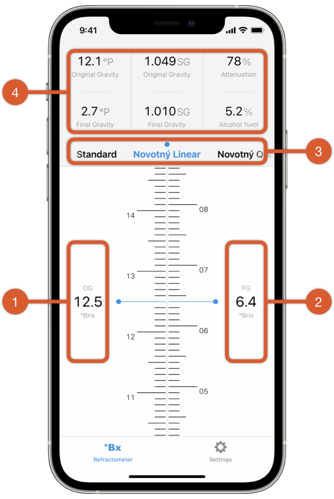
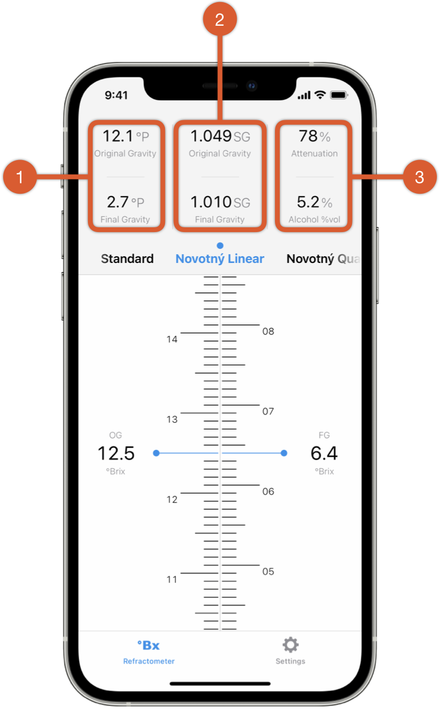

Refracto - Refractometer Calculator for Homebrewers
===================================================

*Refracto* is a tool for homebrewers that will help you to convert your refractometer measurements during a fermentation process from °Brix to SG or °Plato. It automatically compensates the alcohol effect during fermentation.

## How to use Refracto

1. Swipe vertically to enter your initial refractometer reading, i.e. the measurement result for the original wort, just before adding the yeast.
- Swipe vertically to enter your current refractometer reading, i.e. a measurement result after the fermentation process has started.
- Swipe horizontally to switch between the computation modes. Available modes are the Standard formula and Sean Terrill’s linear and cubic formula.
- You are done! In the upper section you can now see the computed values for your beer.

## Computed Values

*Refracto* computes and immediately updates the following values whenever you change one of its input values:

1. The resulting *original gravity* (OG).
- The estimated *alcohol* concentration as percent by volume.
- The *final gravity* (FG), displayed on the top as *apparent gravity* and as *actual gravity* on the bottom. The apparent gravity corresponds to a measurement with a hydrometer.
- The amount of sugars consumed by the yeast so far, displayed as *apparent attenuation* on the top and as *actual attenuation* below.

